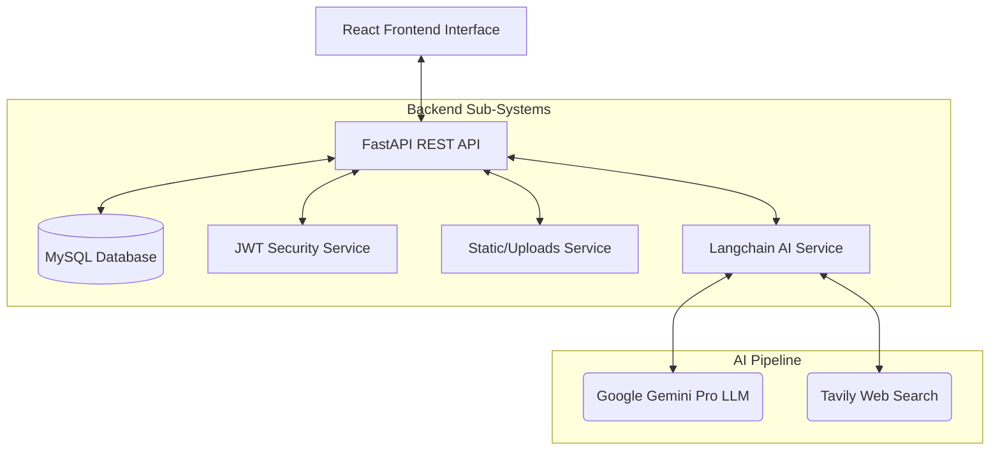

# Yelp Prototype — Lab 1 Report

**Authors:** Prakhar Singh & Nikhil Khaneja  
**Course:** Distributed Systems / Software Engineering Lab 1  
**Repository:** [prakharsinghpersonal/yelp-prototype-lab1](https://github.com/prakharsinghpersonal/yelp-prototype-lab1)  

---

## 1. Introduction
The objective of this lab was to build a comprehensive, full-stack Yelp-like prototype with robust features encompassing real-world scenarios. We developed a highly scalable RESTful backend in Python (FastAPI) paired with a responsive, dynamic frontend in React. 

Core features include dual-role user authentication (Standard Users vs. Business Owners), CRUD operations for restaurant directories and reviews, favorite tracking, user activity histories, robust profile preferences, file uploads (via local static routing), and a state-of-the-art AI chatbot assistant for personalized recommendations.

---

## 2. System Architecture & Design
Our application is split into a decoupled frontend and backend.

### **Frontend (React & Vite)**
- Engineered as a Single Page Application (SPA).
- **Core Dependencies:** `axios` for localized API routing, `react-router-dom` for application routing, and styled with vanilla CSS/Tailwind methodologies for responsive delivery across mobile and desktop.
- Components are modularized under `src/components/` and `src/pages/`, utilizing service layers (`authService.js`, `restaurantService.js`) to interact with the API cleanly.

### **Backend (FastAPI, Python)**
- Follows a layered REST architecture separating routers, business services, and data models.
- **Database:** MySQL database accessed via SQLAlchemy ORM.
- **Authentication:** Role-based JSON Web Tokens (JWT) using `passlib(bcrypt)` for password hashing.
- **File Uploads:** Handled locally within `uploads/`, managed by FastAPI's `StaticFiles` router to directly stream images on restaurant cards and profiles.

### **Architecture Diagram**

---

## 3. AI Implementation Details
We implemented a personalized restaurant recommendation engine that dynamically reads the database and considers live web contexts.

**Workflow:**
1. **Context Initialization:** When a user queries `/ai-assistant/chat`, the backend instantly loads the user's saved preferences metrics (favorite cuisines, max price, dietary needs, ambiance).
2. **Langchain Toolkit:** We utilize a generic LLM chain utilizing the `gemini-pro` model. The user's input, along with their database preferences and conversation history, is structured into an optimal prompt.
3. **Agentic Searching:** To bridge the gap between static database logic and real-world dynamics, the AI leverages the `tavily-search` API to fetch live details about restaurant hours, reviews, or special events if necessary.
4. **Structured Results:** The LLM returns personalized restaurant recommendations detailing *why* the suggestion fits the user based on their dietary needs and budget, bridging logic directly to the mapped internal DB restaurants.

---

## 4. Results & Screenshots

Here is a showcase of the completed prototype running in a local environment:

### **1. Explore & Search Page**
The primary hub for all users to browse directories based on query and filter parameters (with paginated cards).

### **2. Restaurant Details & Review Board**
Users can view complete business stats, add the restaurant to their favorites, browse the photo gallery, and publish public reviews.

### **3. AI Chatbot Assistant**
Testing the real AI integration where it queries the user's specific preferences and recommends matched results.

### **4. Advanced Owner Actions (The "Claim" Flow)**
Epic 7's specialized system allowing authenticated Owners to assume control over public venue listings to access specialized analytics.

