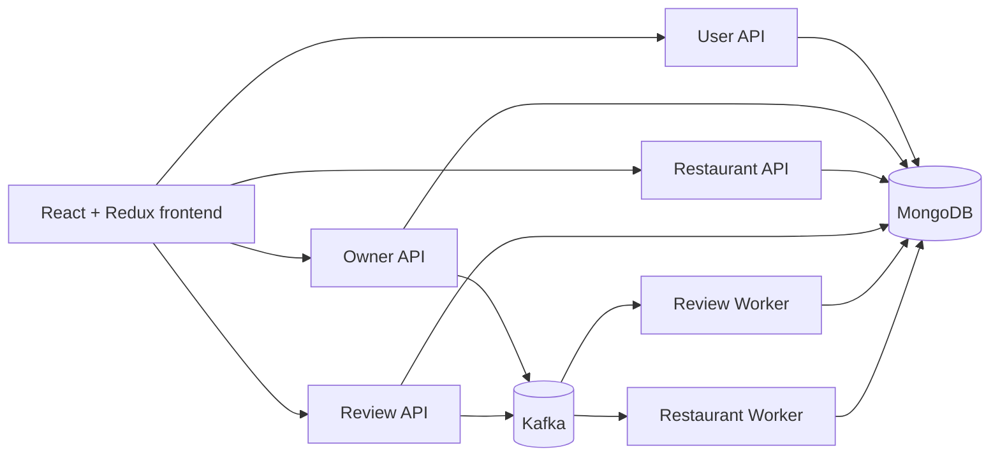

# YelpStar Lab 2

Distributed Yelp prototype upgraded for Lab 2 with:

- MongoDB for users, sessions, restaurants, reviews, favorites, photos, and activity logs
- Kafka-backed producer/consumer flow for review and restaurant mutations
- Service-specific FastAPI entrypoints for `user`, `owner`, `restaurant`, and `review`
- Redux state management for auth, restaurants, reviews, and favorites
- Docker, Docker Compose, Kubernetes, and JMeter assets for deployment and testing

## Lab 2 architecture



## Backend changes

- `backend/db/database.py` now connects to MongoDB and manages indexes/counters.
- `backend/services/event_bus.py` publishes Kafka topics and can process inline for local dev.
- `backend/services/event_handlers.py` handles `review.created`, `review.updated`, `review.deleted`, `restaurant.created`, `restaurant.updated`, `restaurant.deleted`, and `restaurant.claimed`.
- `backend/workers/kafka_worker.py` is the standalone Kafka consumer for worker deployments.
- `backend/apps/*.py` exposes separate app entrypoints for Lab 2 service containers.

### MongoDB collections

- `users`
- `sessions`
- `restaurants`
- `reviews`
- `favorites`
- `user_preferences`
- `events`
- `counters`

Passwords are stored with `bcrypt`. Sessions are persisted in `sessions` with TTL expiry.

## Frontend changes

Redux store lives in `frontend/src/store` and includes:

- `authSlice`
- `restaurantSlice`
- `reviewSlice`
- `favoritesSlice`

Service routing is now split by environment variables:

- `VITE_USER_SERVICE_URL`
- `VITE_OWNER_SERVICE_URL`
- `VITE_RESTAURANT_SERVICE_URL`
- `VITE_REVIEW_SERVICE_URL`

If these are not set, the frontend falls back to `VITE_API_URL` or `http://localhost:8000`.

## Local setup

### Backend only

```bash
cd backend
python3 -m venv venv
source venv/bin/activate
pip install -r requirements.txt
python seed_db.py
uvicorn main:app --reload --port 8000
```

Required environment variables:

- `MONGODB_URI`
- `MONGODB_DB_NAME`
- `SECRET_KEY`
- `KAFKA_BOOTSTRAP_SERVERS` (optional for local inline mode)
- `KAFKA_INLINE_CONSUMER=true`
- `GROQ_API_KEY` (optional)
- `TAVILY_API_KEY` (optional)

### Frontend only

```bash
cd frontend
npm install
npm run dev
```

### Full stack with Docker Compose

```bash
docker compose up --build
```

Services:

- Frontend: `http://localhost:3000`
- User API: `http://localhost:8001`
- Owner API: `http://localhost:8002`
- Restaurant API: `http://localhost:8003`
- Review API: `http://localhost:8004`
- MongoDB: `mongodb://localhost:27017`
- Kafka: `localhost:9092`

## Docker assets

Dockerfiles are included for:

- `deploy/docker/user-service.Dockerfile`
- `deploy/docker/owner-service.Dockerfile`
- `deploy/docker/restaurant-service.Dockerfile`
- `deploy/docker/review-service.Dockerfile`
- `deploy/docker/kafka-worker.Dockerfile`
- `deploy/docker/frontend.Dockerfile`

## Kubernetes assets

Manifests are under `deploy/k8s`:

- `namespace.yaml`
- `mongo.yaml`
- `kafka.yaml`
- `services.yaml`
- `workers-and-frontend.yaml`

Update the placeholder image names before applying:

```bash
kubectl apply -f deploy/k8s/namespace.yaml
kubectl apply -f deploy/k8s/mongo.yaml
kubectl apply -f deploy/k8s/kafka.yaml
kubectl apply -f deploy/k8s/services.yaml
kubectl apply -f deploy/k8s/workers-and-frontend.yaml
```

## Kafka topics used

- `review.created`
- `review.updated`
- `review.deleted`
- `restaurant.created`
- `restaurant.updated`
- `restaurant.deleted`
- `restaurant.claimed`

## JMeter

Artifacts:

- Test plan: `performance/yelp-lab2-plan.jmx`
- Results template: `performance/results-summary.md`

Run the test plan at 100, 200, 300, 400, and 500 concurrent users and export your aggregate report screenshots for the report.

## Report checklist

- Add AWS screenshots of all running services
- Add Redux DevTools screenshots for at least two slices
- Add Kafka message-flow screenshots
- Add JMeter charts/results
- Replace placeholder Kubernetes image names with your pushed images
