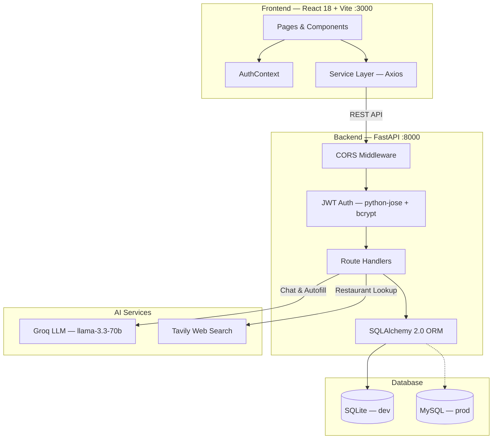
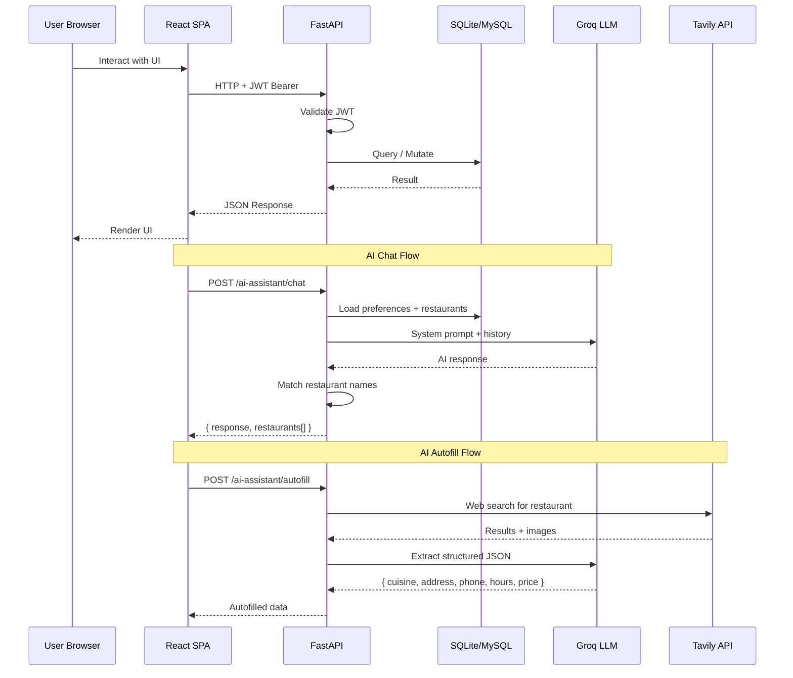
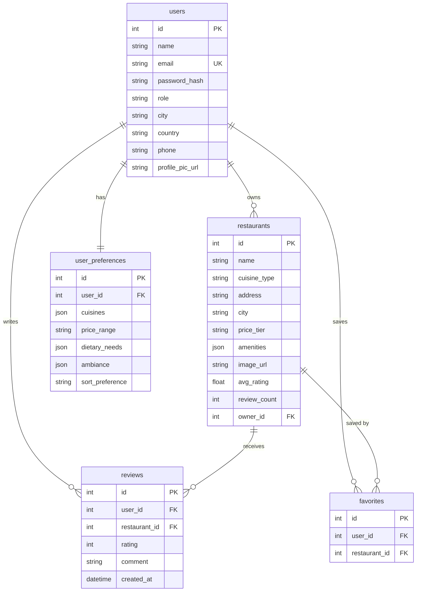

# YelpStar — Restaurant Discovery & Review Platform

> **Course:** Distributed Systems — Lab 1
> **Stack:** Python 3.14 · FastAPI · SQLite/MySQL · React 18 · Groq AI · Tavily

---

## Architecture



### Request Flow



### Database Schema



---

## Team

| Member | Role |
|---|---|
| **Prakhar Singh** | Backend — FastAPI, DB, JWT auth, AI chatbot, Tavily/Groq, E2E tests |
| **Nikhil Khaneja** | Frontend — React UI, pages/components, chat interface, TailwindCSS |

---

## Tech Stack

| Layer | Technology |
|---|---|
| Frontend | React 18 + Vite |
| Styling | TailwindCSS |
| HTTP Client | Axios |
| Backend | Python 3.14 + FastAPI |
| ORM | SQLAlchemy 2.0.48 |
| Database | SQLite (dev) / MySQL (prod) |
| Auth | JWT (python-jose + bcrypt) |
| AI LLM | Groq — llama-3.3-70b |
| Web Search | Tavily API |
| Maps | Leaflet + react-leaflet v4 |

---

## Project Structure

```
Lab 1/
├── backend/
│   ├── main.py                  # FastAPI app + CORS + route registration
│   ├── db/database.py           # SQLAlchemy engine + session
│   ├── models/
│   │   ├── models.py            # ORM models
│   │   └── schemas.py           # Pydantic schemas
│   ├── routes/
│   │   ├── auth.py              # Signup, login (user + owner)
│   │   ├── users.py             # Profile CRUD, photo upload, preferences
│   │   ├── restaurants.py       # Restaurant CRUD, search, dashboard, claim
│   │   ├── reviews.py           # Review CRUD
│   │   ├── favorites.py         # Favorites
│   │   ├── history.py           # User history
│   │   └── ai_chat.py           # AI chat + autofill
│   ├── services/auth.py         # JWT + bcrypt
│   ├── seed_db.py               # 12 restaurants + demo users
│   ├── test_e2e.py              # 46 E2E tests
│   └── .env.example
│
├── frontend/
│   ├── src/
│   │   ├── pages/               # 9 user pages + 7 owner pages
│   │   ├── components/          # Navbar, RestaurantCard, AiChatWidget, SkeletonCard, MapErrorBoundary
│   │   ├── contexts/            # AuthContext
│   │   ├── hooks/               # useDarkMode
│   │   ├── services/            # API service modules
│   │   └── utils/               # Country/state data
│   ├── index.html
│   ├── vite.config.js
│   ├── tailwind.config.js
│   └── package.json
│
└── README.md
```

---

## Setup

### Backend

```bash
cd backend
python3 -m venv venv && source venv/bin/activate
pip install -r requirements.txt
cp .env.example .env   # add your API keys
python seed_db.py
uvicorn main:app --reload --port 8000
```

### Frontend

```bash
cd frontend
npm install
npm run dev
```

### Environment Variables (`backend/.env`)

```env
DATABASE_URL=sqlite:///./yelp.db
SECRET_KEY=your-jwt-secret
GROQ_API_KEY=your_groq_key
TAVILY_API_KEY=your_tavily_key
UPLOAD_DIR=uploads
```

Frontend: `frontend/.env` → `VITE_API_URL=http://localhost:8000`

---

## API Endpoints (27)

Swagger UI: `http://localhost:8000/docs`

| Method | Endpoint | Auth | Description |
|---|---|---|---|
| `POST` | `/auth/signup` | — | Register user |
| `POST` | `/auth/login` | — | Login → JWT |
| `POST` | `/auth/owner/signup` | — | Register owner |
| `POST` | `/auth/owner/login` | — | Owner login |
| `GET` | `/users/me` | JWT | Get profile |
| `PUT` | `/users/me` | JWT | Update profile |
| `POST` | `/users/me/photo` | JWT | Upload photo |
| `GET` | `/users/me/preferences` | JWT | Get preferences |
| `PUT` | `/users/me/preferences` | JWT | Save preferences |
| `GET` | `/users/me/history` | JWT | Activity history |
| `GET` | `/restaurants` | — | List/search/filter |
| `GET` | `/restaurants/{id}` | — | Restaurant details |
| `POST` | `/restaurants` | JWT | Create restaurant |
| `PUT` | `/restaurants/{id}` | JWT | Update (owner) |
| `DELETE` | `/restaurants/{id}` | JWT | Delete (owner) |
| `POST` | `/restaurants/{id}/claim` | JWT | Claim restaurant |
| `GET` | `/restaurants/owner/dashboard` | JWT | Owner dashboard |
| `GET` | `/restaurants/{id}/reviews` | — | List reviews |
| `POST` | `/restaurants/{id}/reviews` | JWT | Create review |
| `PUT` | `/reviews/{id}` | JWT | Update review |
| `DELETE` | `/reviews/{id}` | JWT | Delete review |
| `GET` | `/favorites` | JWT | List favorites |
| `POST` | `/favorites/{id}` | JWT | Add favorite |
| `DELETE` | `/favorites/{id}` | JWT | Remove favorite |
| `POST` | `/ai-assistant/chat` | JWT | AI chat |
| `POST` | `/ai-assistant/autofill` | JWT | AI autofill |

---

## E2E Tests — 46/46 PASS

```bash
cd backend && python test_e2e.py
```

| Section | Tests |
|---|---|
| Server Health | 2 |
| User Auth | 5 |
| Owner Auth | 3 |
| User Profile | 3 |
| Preferences | 2 |
| Restaurants | 9 |
| Reviews | 6 |
| Favourites | 4 |
| History | 3 |
| AI Chatbot | 7 |
| Owner Dashboard + Claim | 2 |

---

## Demo Credentials

| Email | Password | Role |
|---|---|---|
| `user@example.com` | `password123` | User |
| `owner@example.com` | `password123` | Owner |
